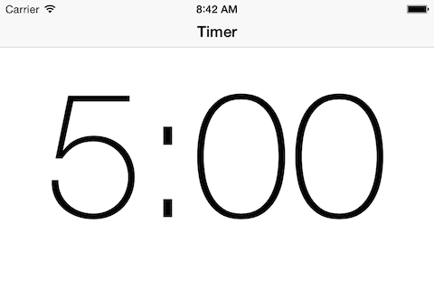

# The Final Countdown

Let's make a better timer app.

## The Interface:

Here is a picture of the countdown timer app in portrait:

![Portrait][portrait.png]

Here is a picture after you hit the Start button.

![Portrait 2][portrait2.png]

Your goal is to make a paired down version of this:

  * Don't do the tabBarController
  * Don't do the `When Timer Ends Button`
  * For the first iteration, just use regular buttons. That lower grey thing is half of the height of the view. 
  * Center the start/pause buttons in the lower grey sections
  * Make sure the pickerView and the label are below the `UINavigationBar`. To do this simply, just add `44` in portrait and `32` pts in landscape. If you want to do this correctly we need to use the `topLayoutGuide` of `UIViewController`. Sadly, this property only exists after ViewDidLoad. We need to actually override the `viewDidLayoutSubviews` method. To grab the `topLayoutGuide` do something like this:

  ```
  id topLayoutGuide = self.topLayoutGuide;
  NSDictionary *views = NSDictionaryOfVariableBindings(topLayoutGuide,_myLabel);
  ```
  At the end you have to continue the layout process and call the `layoutIfNeeded` method on `self.view`.
  * For right now, when you tap the start button the uiPickerView should be hidden, and the Label with a time should be shown. Don't worry about making it work just yet.
  * When you rotate to landscape. It should just show the time label full screen. So like this:

  
